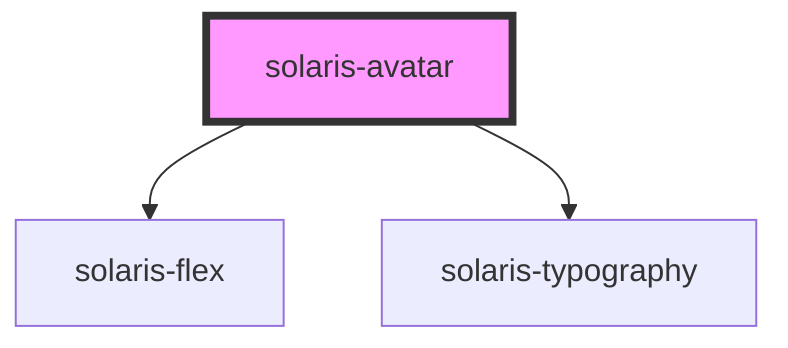

# solaris-avatar

<!-- Auto Generated Below -->

## Properties

| Property          | Attribute          | Description | Type                                                                                    | Default       |
| ----------------- | ------------------ | ----------- | --------------------------------------------------------------------------------------- | ------------- |
| `backgroundColor` | `background-color` |             | `"black" \| "cobalt" \| "comet" \| "danger" \| "nebula-blue" \| "supernova" \| "white"` | `'supernova'` |
| `backgroundImage` | `background-image` |             | `string`                                                                                | `undefined`   |
| `size`            | `size`             |             | `"default" \| "lg" \| "md" \| "sm" \| "xl" \| "xs" \| "xxl"`                            | `'md'`        |
| `variant`         | `variant`          |             | `"circle" \| "rectangle" \| "square"`                                                   | `'circle'`    |

## Dependencies

### Depends on

- [solaris-flex](../solaris-flex)
- [solaris-typography](../solaris-typography)

### Graph

----------------------------------------------

*Built with [StencilJS](https://stenciljs.com/)*
