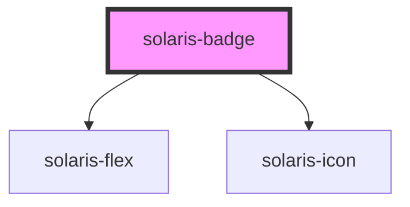

# solaris-badge

<!-- Auto Generated Below -->

## Properties

| Property       | Attribute       | Description | Type                                                                                                               | Default     |
| -------------- | --------------- | ----------- | ------------------------------------------------------------------------------------------------------------------ | ----------- |
| `icon`         | `icon`          |             | `string \| { name: string; variant?: string; size?: "default" \| "xs" \| "sm" \| "md" \| "lg" \| "xl" \| "xxl"; }` | `undefined` |
| `iconPosition` | `icon-position` |             | `"left" \| "right"`                                                                                                | `'left'`    |
| `radius`       | `radius`        |             | `"default" \| "lg" \| "md" \| "sm" \| "xl" \| "xs" \| "xxl"`                                                       | `undefined` |
| `size`         | `size`          |             | `"default" \| "lg" \| "md" \| "sm" \| "xl" \| "xs" \| "xxl"`                                                       | `'md'`      |
| `type`         | `type`          |             | `"error" \| "info" \| "info-nebula" \| "success" \| "warning"`                                                     | `undefined` |

## Dependencies

### Depends on

- [solaris-flex](../solaris-flex)
- [solaris-icon](../solaris-icon)

### Graph

----------------------------------------------

*Built with [StencilJS](https://stenciljs.com/)*
