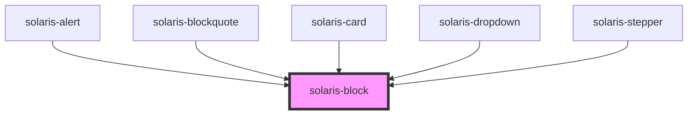

# solaris-block

<!-- Auto Generated Below -->

## Properties

| Property      | Attribute     | Description | Type                                                                                                                                                           | Default     |
| ------------- | ------------- | ----------- | -------------------------------------------------------------------------------------------------------------------------------------------------------------- | ----------- |
| `breakpoints` | `breakpoints` |             | `"hide-on-lg" \| "hide-on-md" \| "hide-on-sm" \| "hide-on-xl" \| "hide-on-xs" \| "show-on-lg" \| "show-on-md" \| "show-on-sm" \| "show-on-xl" \| "show-on-xs"` | `undefined` |

## Dependencies

### Used by

 - [solaris-alert](../solaris-alert)
 - [solaris-blockquote](../solaris-blockquote)
 - [solaris-card](../solaris-card)
 - [solaris-dropdown](../solaris-dropdown)
 - [solaris-stepper](../solaris-stepper)

### Graph

----------------------------------------------

*Built with [StencilJS](https://stenciljs.com/)*
