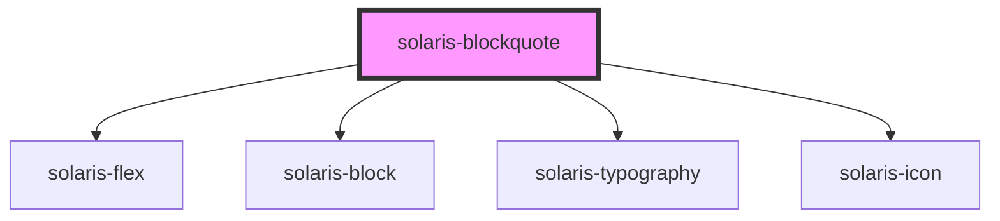

# solaris-blockquote

<!-- Auto Generated Below -->

## Properties

| Property             | Attribute             | Description | Type                                                                                                                                                       | Default     |
| -------------------- | --------------------- | ----------- | ---------------------------------------------------------------------------------------------------------------------------------------------------------- | ----------- |
| `__title`            | `__title`             |             | `string`                                                                                                                                                   | `undefined` |
| `bordered`           | `bordered`            |             | `boolean`                                                                                                                                                  | `undefined` |
| `decorationPosition` | `decoration-position` |             | `"bottom" \| "left" \| "right" \| "top"`                                                                                                                   | `'top'`     |
| `icon`               | `icon`                |             | `string \| { name: string; variant?: string; size?: "default" \| "xs" \| "sm" \| "md" \| "lg" \| "xl" \| "xxl"; }`                                         | `undefined` |
| `iconPosition`       | `icon-position`       |             | `"left" \| "right"`                                                                                                                                        | `'left'`    |
| `maxWidth`           | `max-width`           |             | `"auto" \| "fit-content" \| "max-content" \| `${number}%` \| `${number}em` \| `${number}px` \| `${number}rem` \| `${number}vh` \| `${number}vw` \| number` | `undefined` |
| `radius`             | `radius`              |             | `"default" \| "lg" \| "md" \| "sm" \| "xl" \| "xs" \| "xxl"`                                                                                               | `undefined` |
| `type`               | `type`                |             | `"error" \| "info" \| "info-nebula" \| "success" \| "warning"`                                                                                             | `'info'`    |

## Dependencies

### Depends on

- [solaris-flex](../solaris-flex)
- [solaris-block](../solaris-block)
- [solaris-typography](../solaris-typography)
- [solaris-icon](../solaris-icon)

### Graph

----------------------------------------------

*Built with [StencilJS](https://stenciljs.com/)*
