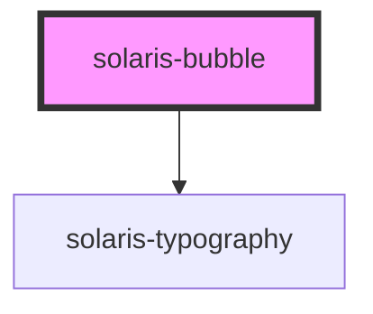

# solaris-bubble

<!-- Auto Generated Below -->

## Properties

| Property     | Attribute | Description | Type                                                                        | Default     |
| ------------ | --------- | ----------- | --------------------------------------------------------------------------- | ----------- |
| `innerStyle` | --        |             | `{ [key: string]: string; }`                                                | `{}`        |
| `text`       | `text`    |             | `string`                                                                    | `''`        |
| `type`       | `type`    |             | `"default" \| "error" \| "info" \| "info-nebula" \| "success" \| "warning"` | `'default'` |

## Dependencies

### Depends on

- [solaris-typography](../solaris-typography)

### Graph

----------------------------------------------

*Built with [StencilJS](https://stenciljs.com/)*
