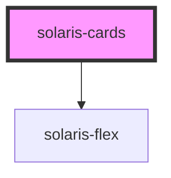

# solaris-cards

<!-- Auto Generated Below -->

## Properties

| Property    | Attribute   | Description | Type                                                         | Default     |
| ----------- | ----------- | ----------- | ------------------------------------------------------------ | ----------- |
| `elevation` | `elevation` |             | `number`                                                     | `undefined` |
| `radius`    | `radius`    |             | `"default" \| "lg" \| "md" \| "sm" \| "xl" \| "xs" \| "xxl"` | `'default'` |

## Dependencies

### Depends on

- [solaris-flex](../solaris-flex)

### Graph

----------------------------------------------

*Built with [StencilJS](https://stenciljs.com/)*
