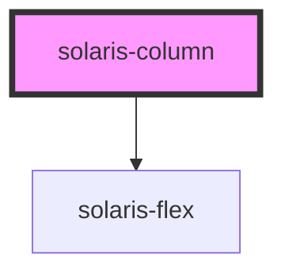

# solaris-column

<!-- Auto Generated Below -->

## Properties

| Property | Attribute | Description | Type                                                         | Default     |
| -------- | --------- | ----------- | ------------------------------------------------------------ | ----------- |
| `col`    | `col`     |             | `"default" \| "lg" \| "md" \| "sm" \| "xl" \| "xs" \| "xxl"` | `'md'`      |
| `gap`    | `gap`     |             | `number`                                                     | `undefined` |

## Dependencies

### Depends on

- [solaris-flex](../solaris-flex)

### Graph

----------------------------------------------

*Built with [StencilJS](https://stenciljs.com/)*
