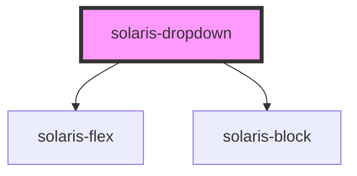

# solaris-dropdown

<!-- Auto Generated Below -->

## Properties

| Property        | Attribute        | Description | Type                | Default       |
| --------------- | ---------------- | ----------- | ------------------- | ------------- |
| `arrowPosition` | `arrow-position` |             | `"left" \| "right"` | `'left'`      |
| `backdrop`      | `backdrop`       |             | `boolean`           | `undefined`   |
| `button`        | --               |             | `Element`           | `undefined`   |
| `colorScheme`   | `color-scheme`   |             | `ColorScheme`       | `'supernova'` |
| `decorated`     | `decorated`      |             | `boolean`           | `undefined`   |
| `left`          | `left`           |             | `UnitString`        | `undefined`   |
| `top`           | `top`            |             | `UnitString`        | `undefined`   |

## Dependencies

### Depends on

- [solaris-flex](../solaris-flex)
- [solaris-block](../solaris-block)

### Graph

----------------------------------------------

*Built with [StencilJS](https://stenciljs.com/)*
