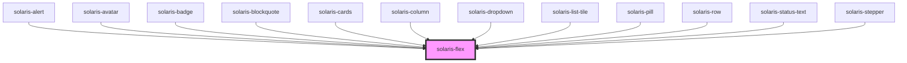

# solaris-flex

<!-- Auto Generated Below -->

## Properties

| Property         | Attribute         | Description | Type                                                                                            | Default        |
| ---------------- | ----------------- | ----------- | ----------------------------------------------------------------------------------------------- | -------------- |
| `alignItems`     | `align-items`     |             | `"center" \| "flex-end" \| "flex-start" \| "space-around" \| "space-between" \| "space-evenly"` | `'flex-start'` |
| `direction`      | `direction`       |             | `"column" \| "column-reverse" \| "row" \| "row-reverse"`                                        | `'row'`        |
| `gap`            | `gap`             |             | `number`                                                                                        | `undefined`    |
| `justifyContent` | `justify-content` |             | `"center" \| "flex-end" \| "flex-start" \| "space-around" \| "space-between" \| "space-evenly"` | `'flex-start'` |
| `wrap`           | `wrap`            |             | `"nowrap" \| "wrap" \| "wrap-reverse"`                                                          | `'wrap'`       |

## Dependencies

### Used by

 - [solaris-alert](../solaris-alert)
 - [solaris-avatar](../solaris-avatar)
 - [solaris-badge](../solaris-badge)
 - [solaris-blockquote](../solaris-blockquote)
 - [solaris-cards](../solaris-cards)
 - [solaris-column](../solaris-column)
 - [solaris-dropdown](../solaris-dropdown)
 - [solaris-list-tile](../solaris-list-tile)
 - [solaris-pill](../solaris-pill)
 - [solaris-row](../solaris-row)
 - [solaris-status-text](../solaris-status-text)
 - [solaris-stepper](../solaris-stepper)

### Graph

----------------------------------------------

*Built with [StencilJS](https://stenciljs.com/)*
