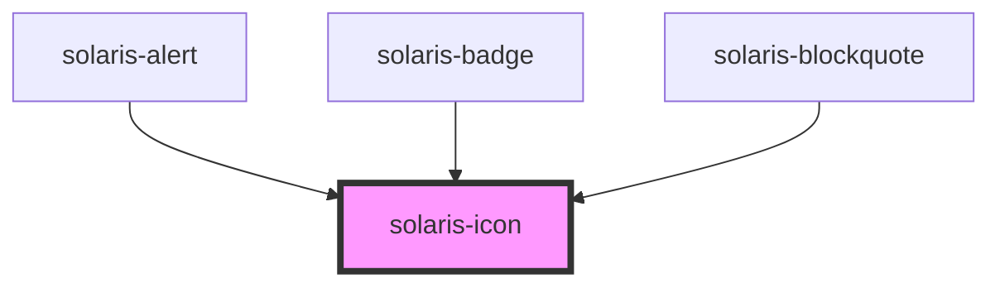

# solaris-icon

<!-- Auto Generated Below -->

## Properties

| Property  | Attribute | Description | Type                                                         | Default     |
| --------- | --------- | ----------- | ------------------------------------------------------------ | ----------- |
| `name`    | `name`    |             | `string`                                                     | `undefined` |
| `size`    | `size`    |             | `"default" \| "lg" \| "md" \| "sm" \| "xl" \| "xs" \| "xxl"` | `undefined` |
| `variant` | `variant` |             | `string`                                                     | `'regular'` |

## Dependencies

### Used by

 - [solaris-alert](../solaris-alert)
 - [solaris-badge](../solaris-badge)
 - [solaris-blockquote](../solaris-blockquote)

### Graph

----------------------------------------------

*Built with [StencilJS](https://stenciljs.com/)*
