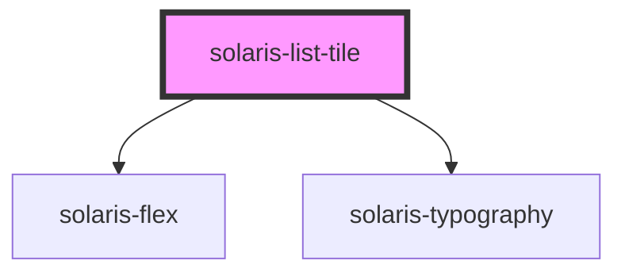

# solaris-list-tile

<!-- Auto Generated Below -->

## Properties

| Property  | Attribute | Description | Type                                                                                                                                                       | Default     |
| --------- | --------- | ----------- | ---------------------------------------------------------------------------------------------------------------------------------------------------------- | ----------- |
| `__title` | `__title` |             | `string`                                                                                                                                                   | `undefined` |
| `onClick` | --        |             | `Function`                                                                                                                                                 | `undefined` |
| `width`   | `width`   |             | `"auto" \| "fit-content" \| "max-content" \| `${number}%` \| `${number}em` \| `${number}px` \| `${number}rem` \| `${number}vh` \| `${number}vw` \| number` | `undefined` |

## Dependencies

### Depends on

- [solaris-flex](../solaris-flex)
- [solaris-typography](../solaris-typography)

### Graph

----------------------------------------------

*Built with [StencilJS](https://stenciljs.com/)*
