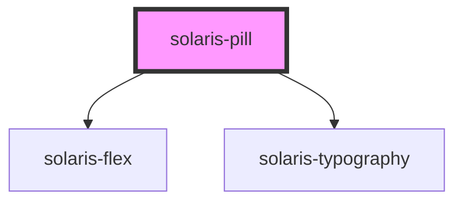

# solaris-pill

<!-- Auto Generated Below -->

## Properties

| Property   | Attribute  | Description | Type                                                           | Default     |
| ---------- | ---------- | ----------- | -------------------------------------------------------------- | ----------- |
| `active`   | `active`   |             | `boolean`                                                      | `undefined` |
| `count`    | `count`    |             | `number`                                                       | `undefined` |
| `label`    | `label`    |             | `string`                                                       | `undefined` |
| `loading`  | `loading`  |             | `boolean`                                                      | `false`     |
| `position` | `position` |             | `"left" \| "right"`                                            | `'right'`   |
| `size`     | `size`     |             | `"default" \| "lg" \| "md" \| "sm" \| "xl" \| "xs" \| "xxl"`   | `undefined` |
| `type`     | `type`     |             | `"error" \| "info" \| "info-nebula" \| "success" \| "warning"` | `undefined` |

## Dependencies

### Depends on

- [solaris-flex](../solaris-flex)
- [solaris-typography](../solaris-typography)

### Graph

----------------------------------------------

*Built with [StencilJS](https://stenciljs.com/)*
