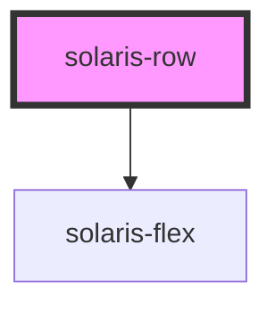

# solaris-row

<!-- Auto Generated Below -->

## Properties

| Property | Attribute | Description | Type     | Default     |
| -------- | --------- | ----------- | -------- | ----------- |
| `gap`    | `gap`     |             | `number` | `undefined` |

## Dependencies

### Depends on

- [solaris-flex](../solaris-flex)

### Graph

----------------------------------------------

*Built with [StencilJS](https://stenciljs.com/)*
