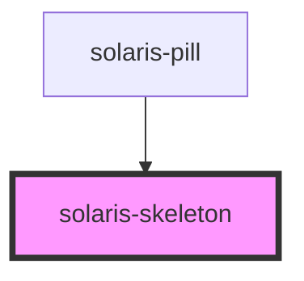

# solaris-skeleton

<!-- Auto Generated Below -->

## Properties

| Property   | Attribute  | Description | Type                                                         | Default     |
| ---------- | ---------- | ----------- | ------------------------------------------------------------ | ----------- |
| `animated` | `animated` |             | `boolean`                                                    | `true`      |
| `height`   | `height`   |             | `number`                                                     | `32`        |
| `radius`   | `radius`   |             | `"default" \| "lg" \| "md" \| "sm" \| "xl" \| "xs" \| "xxl"` | `'default'` |
| `width`    | `width`    |             | `number`                                                     | `undefined` |

## Dependencies

### Used by

 - [solaris-pill](../solaris-pill)

### Graph

----------------------------------------------

*Built with [StencilJS](https://stenciljs.com/)*
