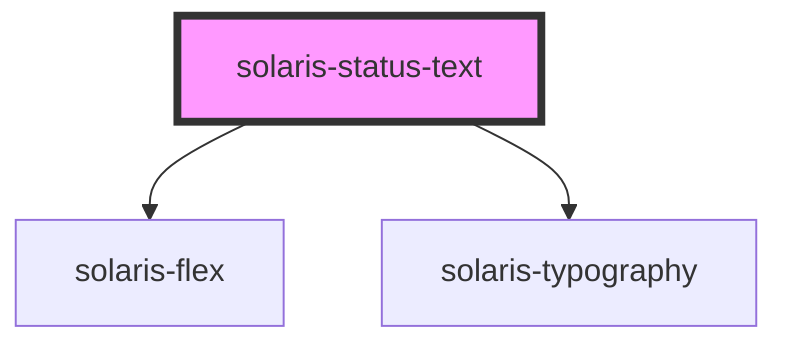

# solaris-status-text

<!-- Auto Generated Below -->

## Properties

| Property  | Attribute | Description | Type                                                                                                          | Default     |
| --------- | --------- | ----------- | ------------------------------------------------------------------------------------------------------------- | ----------- |
| `dot`     | `dot`     |             | `"left" \| "none" \| "right"`                                                                                 | `'left'`    |
| `type`    | `type`    |             | `"disabled" \| "error" \| "info" \| "info-nebula" \| "success" \| "warning"`                                  | `'warning'` |
| `variant` | `variant` |             | `"caption" \| "h1" \| "h2" \| "h3" \| "h4" \| "h5" \| "h6" \| "h7" \| "link" \| "p" \| "small" \| "subtitle"` | `'p'`       |

## Dependencies

### Depends on

- [solaris-flex](../solaris-flex)
- [solaris-typography](../solaris-typography)

### Graph

----------------------------------------------

*Built with [StencilJS](https://stenciljs.com/)*
