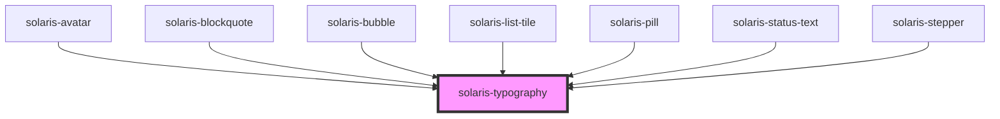

# solaris-typography

<!-- Auto Generated Below -->

## Properties

| Property      | Attribute      | Description | Type                                                                                                                                                                                                                                                                                                                                                                                                                                                                                                            | Default     |
| ------------- | -------------- | ----------- | --------------------------------------------------------------------------------------------------------------------------------------------------------------------------------------------------------------------------------------------------------------------------------------------------------------------------------------------------------------------------------------------------------------------------------------------------------------------------------------------------------------- | ----------- |
| `colorScheme` | `color-scheme` |             | `"error" \| "inherit" \| "danger" \| "supernova" \| "nebula-blue" \| "cobalt" \| "comet" \| "black" \| "white" \| "supernova-dark" \| "nebula-blue-shades" \| "nebula-blue-dark" \| "cobalt-dark" \| "comet-dark" \| "additional-link" \| "success-dark" \| "success-light" \| "error-light" \| "error-dark" \| "alert-light" \| "alert-dark" \| "info-light" \| "info-dark" \| "darkest" \| "darker" \| "neutral" \| "disabled-light" \| "light" \| "lighter" \| "grey-1" \| "grey-2" \| "grey-3" \| "grey-4"` | `'inherit'` |
| `fontFamily`  | `font-family`  |             | `"montserrat" \| "roboto"`                                                                                                                                                                                                                                                                                                                                                                                                                                                                                      | `'roboto'`  |
| `innerStyle`  | --             |             | `{ [key: string]: string; }`                                                                                                                                                                                                                                                                                                                                                                                                                                                                                    | `{}`        |
| `lineHeight`  | `line-height`  |             | `number`                                                                                                                                                                                                                                                                                                                                                                                                                                                                                                        | `1.25`      |
| `truncated`   | `truncated`    |             | `boolean`                                                                                                                                                                                                                                                                                                                                                                                                                                                                                                       | `false`     |
| `underline`   | `underline`    |             | `boolean`                                                                                                                                                                                                                                                                                                                                                                                                                                                                                                       | `false`     |
| `variant`     | `variant`      |             | `"caption" \| "h1" \| "h2" \| "h3" \| "h4" \| "h5" \| "h6" \| "h7" \| "link" \| "p" \| "small" \| "subtitle"`                                                                                                                                                                                                                                                                                                                                                                                                   | `'p'`       |
| `weight`      | `weight`       |             | `"bold" \| "medium" \| "regular" \| "semi-bold"`                                                                                                                                                                                                                                                                                                                                                                                                                                                                | `'regular'` |
| `width`       | `width`        |             | `"auto" \| "fit-content" \| "max-content" \| `${number}%` \| `${number}em` \| `${number}px` \| `${number}rem` \| `${number}vh` \| `${number}vw` \| number`                                                                                                                                                                                                                                                                                                                                                      | `'auto'`    |

## Dependencies

### Used by

 - [solaris-avatar](../solaris-avatar)
 - [solaris-blockquote](../solaris-blockquote)
 - [solaris-bubble](../solaris-bubble)
 - [solaris-list-tile](../solaris-list-tile)
 - [solaris-pill](../solaris-pill)
 - [solaris-status-text](../solaris-status-text)
 - [solaris-stepper](../solaris-stepper)

### Graph

----------------------------------------------

*Built with [StencilJS](https://stenciljs.com/)*
