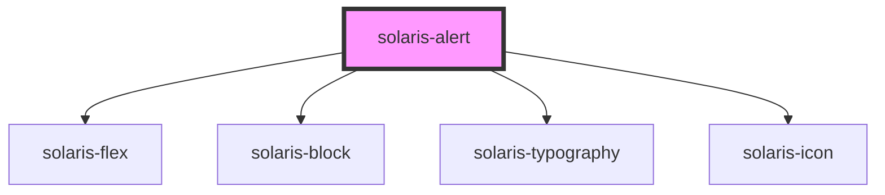

# solaris-alert

<!-- Auto Generated Below -->

## Properties

| Property       | Attribute       | Description | Type                                                                                                                                                       | Default     |
| -------------- | --------------- | ----------- | ---------------------------------------------------------------------------------------------------------------------------------------------------------- | ----------- |
| `__title`      | --              |             | `String`                                                                                                                                                   | `undefined` |
| `bordered`     | `bordered`      |             | `boolean`                                                                                                                                                  | `false`     |
| `icon`         | `icon`          |             | `IconName \| { name: IconName; variant?: IconVariant; size?: Size; }`                                                                                      | `undefined` |
| `iconPosition` | `icon-position` |             | `"left" \| "right"`                                                                                                                                        | `'left'`    |
| `maxWidth`     | `max-width`     |             | `"auto" \| "fit-content" \| "max-content" \| `${number}%` \| `${number}em` \| `${number}px` \| `${number}rem` \| `${number}vh` \| `${number}vw` \| number` | `undefined` |
| `radius`       | `radius`        |             | `"default" \| "lg" \| "md" \| "sm" \| "xl" \| "xs" \| "xxl"`                                                                                               | `'default'` |
| `type`         | `type`          |             | `"error" \| "info" \| "info-nebula" \| "success" \| "warning"`                                                                                             | `'info'`    |

## Dependencies

### Depends on

- [solaris-flex](../solaris-flex)
- [solaris-block](../solaris-block)
- [solaris-typography](../solaris-typography)
- [solaris-icon](../solaris-icon)

### Graph

----------------------------------------------

*Built with [StencilJS](https://stenciljs.com/)*
