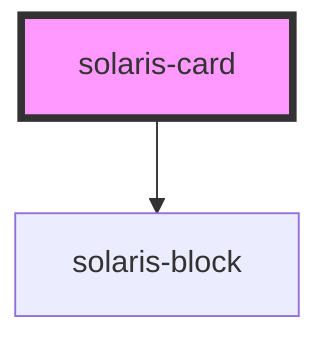

# solaris-card

<!-- Auto Generated Below -->

## Properties

| Property    | Attribute   | Description | Type                                                      | Default     |
| ----------- | ----------- | ----------- | --------------------------------------------------------- | ----------- |
| `elevation` | `elevation` |             | `number`                                                  | `undefined` |
| `radius`    | `radius`    |             | `"default" \| "l" \| "m" \| "s" \| "xl" \| "xs" \| "xxl"` | `undefined` |

## Dependencies

### Depends on

- [solaris-block](../solaris-block)

### Graph

----------------------------------------------

*Built with [StencilJS](https://stenciljs.com/)*
