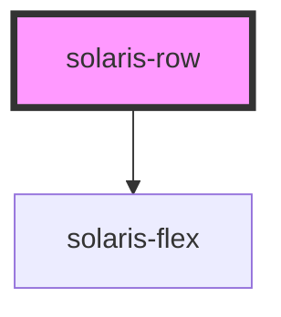

# solaris-row

<!-- Auto Generated Below -->

## Properties

| Property | Attribute | Description | Type                                                                                                                                                       | Default     |
| -------- | --------- | ----------- | ---------------------------------------------------------------------------------------------------------------------------------------------------------- | ----------- |
| `gap`    | `gap`     |             | `"auto" \| "fit-content" \| "max-content" \| `${number}%` \| `${number}em` \| `${number}px` \| `${number}rem` \| `${number}vh` \| `${number}vw` \| number` | `undefined` |

## Dependencies

### Depends on

- [solaris-flex](../solaris-flex)

### Graph

----------------------------------------------

*Built with [StencilJS](https://stenciljs.com/)*
