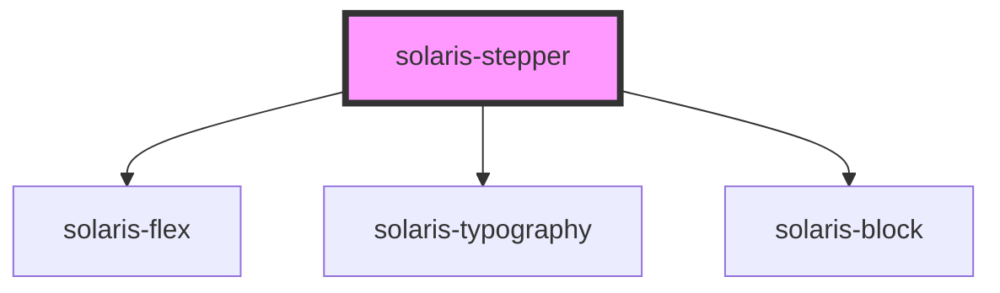

# solaris-stepper

<!-- Auto Generated Below -->

## Properties

| Property       | Attribute       | Description | Type                                                                                    | Default       |
| -------------- | --------------- | ----------- | --------------------------------------------------------------------------------------- | ------------- |
| `colorScheme`  | `color-scheme`  |             | `"black" \| "cobalt" \| "comet" \| "danger" \| "nebula-blue" \| "supernova" \| "white"` | `'supernova'` |
| `currentIndex` | `current-index` |             | `number`                                                                                | `-1`          |
| `steps`        | --              |             | `string[]`                                                                              | `undefined`   |

## Dependencies

### Depends on

- [solaris-flex](../solaris-flex)
- [solaris-typography](../solaris-typography)
- [solaris-block](../solaris-block)

### Graph

----------------------------------------------

*Built with [StencilJS](https://stenciljs.com/)*
